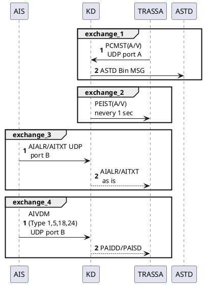

```puml
@startuml
participant AIS 
participant KD  
participant TRASSA
participant ASTD 

autonumber 01
group exchange_1
    TRASSA ->KD: PCMST(A/V)\n UDP port A
    KD ->ASTD: ASTD Bin MSG
end

autonumber stop
group exchange_2
KD -> TRASSA: PEIST(A/V)\nnevery 1 sec
end
autonumber 01
group exchange_3
    AIS ->KD: AIALR/AITXT UDP\n port B
    KD -->TRASSA: AIALR/AITXT\n as is
end
autonumber stop
autonumber 01
group exchange_4
    AIS ->KD: AIVDM\n(Type 1,5,18,24)\n UDP port B
    KD -->TRASSA: PAIDD/PAISD
end
autonumber stop
@enduml
```

