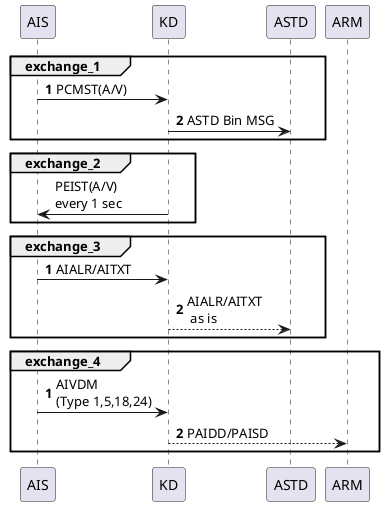

```puml
@startuml
participant AIS 
participant KD  
participant ASTD 
participant ARM

autonumber 01
group exchange_1
    AIS ->KD: PCMST(A/V)
    KD ->ASTD: ASTD Bin MSG
end

autonumber stop
group exchange_2
KD -> AIS: PEIST(A/V)\nevery 1 sec
end
autonumber 01
group exchange_3
    AIS ->KD: AIALR/AITXT 
    KD -->ASTD: AIALR/AITXT\n as is
end
autonumber stop
autonumber 01
group exchange_4
    AIS ->KD: AIVDM\n(Type 1,5,18,24) 
    KD -->ARM: PAIDD/PAISD
end
autonumber stop
@enduml
```


```plantuml
digraph Test {
A -> B
}